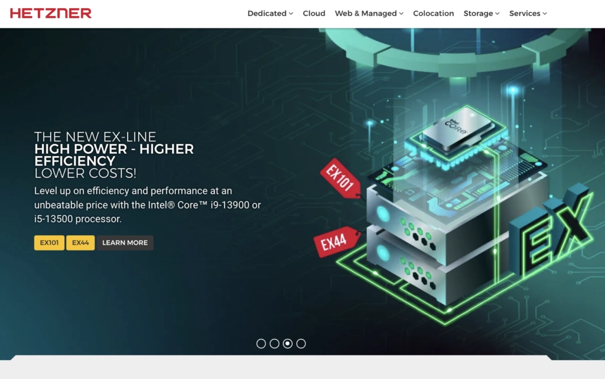

# 2025年最值得选择的6家大容量存储VPS服务商

想象一下：你的业务数据越来越多，现有的服务器空间眼看就要爆满。每次上传文件都提心吊胆，担心哪天突然提示"存储空间不足"。这种感觉，就像住在一个塞满杂物的小公寓里，连转身的地方都没有。

好消息是，选对存储VPS服务商，这些问题统统不是问题。我们测试了市面上主流的存储VPS提供商，从存储容量、读写速度、价格到稳定性，帮你找出真正值得投资的那几家。

---

## 什么是存储VPS？

存储VPS（Storage VPS Hosting）是一种专门为大容量数据存储优化的虚拟专用服务器服务。它把VPS的灵活性和超大存储空间结合起来，特别适合需要存储大量文件、数据库备份或媒体资源的场景。

## 2025年6家最佳存储VPS服务商

如果你正在寻找能够承载海量数据、安全可靠、备份完善，最重要的是价格合理的服务器方案，那这份清单绝对不会让你失望。

### 1. Contabo - 性价比之王

说到存储VPS，Contabo绝对是个狠角色。他们提供超大容量的HDD存储，同时配备快速SSD来提升整体性能。这种组合特别聪明：把需要频繁访问的数据放在SSD上，大量存档数据放在HDD里，既省钱又高效。

**核心优势：**

🔶 **超低价格：** Contabo是市场上最便宜的服务商之一，云VPS套餐起价仅€5.99/月。

🔶 **高性能硬件：** 服务器采用顶级硬件配置，提供多种方案满足不同需求。

🔶 **全球覆盖：** 在全球8个地区11个位置部署服务器，无论用户在哪里都能快速访问。

🔶 **超高在线率：** 99.996%的SLA保证，网站随时在线不掉链子。

🔶 **24/7客服支持：** 客服团队全天候待命，以友好和专业著称。

**为什么选择Contabo？**

你需要一家能以低成本提供高性能、全球任意位置访问的主机商。你需要一个稳定在线、永不掉线的服务。你需要随时能找到人解决问题的优质客服。如果你有这些需求，👉 [Contabo的存储VPS方案绝对值得一试，点击这里了解为什么它能帮你轻松管理海量数据](https://www.vultr.com/?ref=9738262-9J)。

---

### 2. InterServer - 综合实力最强的存储VPS

如果你想找一家在托管领域口碑极好的服务商——超便宜、超快、超可靠，那InterServer VPS可能是你的最佳选择。

**核心优势：**

🔶 **高性能SSD存储：** 采用高性能SSD存储和千兆网络，网站和应用加载速度飞快。

🔶 **独享资源：** 使用VPS意味着CPU、内存、存储都是你一个人的，不会被同服务器的其他用户拖累。

🔶 **灵活配置：** VPS方案高度可定制，可以按需选择资源并灵活扩展。

🔶 **全方位安全防护：** 配备多层安全工具，包括InterShield防火墙、恶意软件扫描和垃圾邮件过滤。

**为什么选择InterServer？**

InterServer是一个价格实惠且极其可靠的托管选择，值得你信赖。无论是作为存储服务器还是满足所有VPS需求，它都能胜任。

---

### 3. Vultr - 快速SSD存储VPS的标杆

Vultr的目标是让高性能云计算变得简单、实惠，并在全球范围内触手可及。

**核心优势：**

🔶 **全球数据中心网络：** Vultr在全球拥有庞大的数据中心网络，你可以把服务器部署在离用户最近的位置，获得最佳性能。

🔶 **按需付费：** 只为实际使用的资源付费，不浪费一分钱。

🔶 **功能丰富：** 提供备份、防火墙、DDoS防护等强大功能，还可以通过API自动化管理云配置。控制面板简单易用，新手也能快速上手。

**价格方案：**

最低只需$5/月就能获得约250GB存储和1TB带宽。总共提供九种不同方案可选。

**为什么选择Vultr？**

网站和应用的所有者经常需要根据需求灵活扩展存储空间，Vultr Object Storage完美满足这一需求。得益于平台可扩展的强大架构，你始终可以依赖强大的数据可靠性、降低的数据复杂性、快速的访问速度和灵活的存储扩展能力。

---

### 4. Hostwinds - 经济实惠的存储VPS解决方案

Hostwinds是一家提供多种托管服务的公司，包括共享主机、VPS托管和专用服务器。需要无限存储和带宽的小型企业应该考虑Hostwinds。

**核心优势：**

🔶 **无限存储空间：** Hostwinds所有共享主机套餐都提供无限存储，想存多少存多少。

🔶 **无限带宽：** 所有套餐都包含无限带宽，不用担心网站因流量大而变慢或无法访问。

🔶 **免费SSL证书：** 所有套餐都配备免费SSL证书，保护网站安全。

🔶 **用户友好的控制界面：** 使用广受欢迎的cPanel控制面板，网站管理轻而易举。还集成了Softaculous自动安装器，一键安装常用Web应用。

🔶 **全天候客服：** 7×24小时客户支持随时待命。

**为什么选择Hostwinds？**

- 无限带宽和存储空间
- 所有服务器提供全天候客服
- 基础套餐包含每日备份
- 提供免费SSL证书
- 无限子域名

---

### 5. UltaHost - 安全且实惠的存储VPS

市场上每天都有新的主机商冒出来。UltaHost就是其中之一。这些新玩家往往以出色的客户导向功能和服务脱颖而出。

**核心优势：**

🔶 **无限带宽和存储：** 所有套餐都提供无限带宽和存储，让你托管网站无后顾之忧。

🔶 **免费SSL证书：** 每个套餐都包含免费SSL证书，保护网站和用户信息安全。

🔶 **免费域名：** 每个年付套餐都赠送一个免费域名，让网站启动更快更简单。

🔶 **便捷客服支持：** 提供实时聊天、邮件和电话支持，一周七天随时解决问题。

🔶 **提供托管式服务：** 部分套餐提供托管服务，意味着他们会处理网站维护的所有技术细节，你可以专注于其他事情。

**为什么选择UltaHost？**

除了上述所有功能，价格也极具竞争力。得益于UltaHost的免费网站迁移服务，你可以快速从其他主机商迁移到UltaHost，完全不用担心数据丢失。

---

### 6. Hetzner - 顶级性能的托管服务商

Hetzner提供经济实惠且速度极快的云服务器。他们的专用服务器同样物超所值。

需要高性能、可靠且价格合理托管服务的企业可以考虑Hetzner。此外，对于需要灵活性和高安全性的公司来说，这也是绝佳选择。

**核心优势：**

🔶 **卓越性能：** Hetzner的德国数据中心配备最新技术，保证服务器出色的性能和可靠性。

🔶 **预算友好：** 特别是专用服务器，Hetzner的价格极具竞争力，非常适合需要高性能服务器但预算有限的公司。

🔶 **高度灵活：** 从Hetzner提供的广泛选择中，你可以选择最适合需求的服务器配置。此外，服务器可以轻松扩展或缩减。

🔶 **安全可靠：** Hetzner运营的数据中心高度安全，配备持续监控和多重安全措施，防止未经授权访问你的数据。

**为什么选择Hetzner？**

如果你需要顶级性能、可靠性和安全性，同时又不想花大价钱，Hetzner绝对是理想选择。

---

## 常见问题解答

**1GB内存对存储VPS够用吗？**

对于流量较小的简单网站来说，1GB内存可能够用。但对于高流量网站或更复杂的应用程序，1GB内存可能不够。

**我可以把VPS当作存储使用吗？**

当然可以。步骤如下：选择一家VPS托管公司，选择VPS套餐，安装文件共享或云存储应用程序。配置应用程序后，就可以开始使用存储空间了。

**可以免费使用存储VPS吗？**

可以免费使用。对于不需要太多存储或带宽的小型企业或个人项目，免费套餐是明智选择。但如果需要更多资源，就得购买付费套餐了。

**为什么选择存储VPS托管？**

存储VPS托管是需要大量存储空间和高性能的企业的理想选择。如果你的网站或应用需要海量存储和卓越性能，那么存储VPS就是你的最佳选项。

**可以自定义存储VPS套餐的容量吗？**

可以。大多数托管公司都提供多种存储方案，方便你选择最符合需求的那个。如果需要额外容量，随时都可以升级套餐。

---

## 总结

总的来说，VPS托管的适用性取决于你的具体需求、技术经验水平和预算限制。

对于许多寻求可靠且可扩展托管解决方案的个人和公司来说，VPS是热门选择，因为它在性能、控制和成本之间取得了完美平衡。👉 [如果你想要兼具灵活性和稳定性的存储方案，不妨看看Vultr如何帮你轻松应对数据增长挑战](https://www.vultr.com/?ref=9738262-9J)。如有任何疑问，欢迎随时联系我们，我们很乐意提供帮助。
